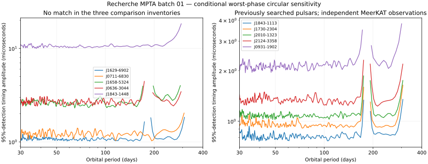

# MeerKAT first bounded original-search batch

Owner authorization, 2026-09-08: proceed with the four-step plan to inventory the
83 MPTA targets against earlier planet searches, choose approximately ten using
data quality and model complexity, carry published noise models into automatic
calibration, and report candidates and sensitivity limits from a bounded search.
This authorizes preparation, localized adapter repairs, calibration and observed
execution. Keep the project private and preserve completed historical searches.

## Prospective scope

Use the public MPTA 4.5-year release (Miles et al., DOI 10.57891/j0vh-5g31),
whose archive is already retained with SHA-256
`172eb9472f4788f22bfe3b24faad2dc0169fca680b80340e4c829201fdafc393`.
New inputs and results live in `../Project Recherche Data/mpta-batch01-20260908/`.
Qualified `src/`, existing calibration core and earlier observed results remain
preserved. No new known-companion removal or known-period window is used.

Selection precedes any observed periodogram. Favor isolated pulsars with at
least 1,200 days and 40 epochs; exclude known long-orbit stellar systems and
published deterministic chromatic events for this first bounded implementation.
Rank eligible targets first by coverage in the earlier dedicated JBO800,
NANOGrav11 and EPTA DR2 planet searches, then noise complexity and a precision
proxy from supplied TOA uncertainties and epochs. Record all 83 dispositions.
Earlier search membership is distinct from general publication attention. Absence
from these samples is not proof that a target has never been searched.

Search 30–400 days, frequency oversampling 5, one fixed circular-signal grid per
target. Use a maximum of ten targets and a batch false-alarm allowance of 1%:
retain `false_alarm_probability=0.01` with `search_count=10` in the existing
calibrator, whose analytical bound assigns at most 0.001 per target under the
fixed Gaussian model. Keep 4,096 nulls per target; use independent recorded
seeds. Count all grid cells, including masked ones, in the bound. Automatic
identifiability masks retain their existing 20% power and conditioning criteria.
A peak exceeding threshold is a candidate requiring follow-up, not a discovery.
Do not add residual-dependent replacement targets or scan alternative policies
until something triggers. Any preparation failure remains a reported gap.

Bind published noise values before scans. Treat uncertainties in noise parameters
as a limitation of a fixed-covariance exploratory search. Report 95%-detection
sensitivity for circular signals on eligible grid cells, not unconditional mass
upper limits or a measured pulsar-planet occurrence rate. Optional conversion to
projected companion mass must explicitly assume a pulsar mass. Inspect model
adequacy separately from the peak statistic. Preserve all failed attempts.

Research mode: focused evidence audit, one analyst. Source coverage is the three
earlier dedicated surveys, the MPTA release/methods, and targeted checks of
potentially confounding companions. Stop after obtaining sample inventories,
usable noise specifications and resolved selection dispositions. This is not a
systematic review or a claim of exhaustive novelty. Original source downloads,
queries, hashes and table extraction are retained under `research/`.

## Implemented model and direct verification

The source is Miles et al., arXiv:2412.01148v1, Table 1 (PDF pages 19–22),
Table 2 (page 23), equations 5–6 and section 4.2. Original HTML, PDF and extracted
cells are retained; the noise and event tables were rendered and inspected.
Use the Table 1 MAP values without fitting them to the search peaks:

- White covariance is `(EFAC * reported_sigma)^2 + EQUAD^2`, with ECORR squared
  correlated across the sub-bands from each observation filename.
- Add the published intrinsic achromatic red process when present, plus the
  additional fixed-index 13/3 achromatic process at its Table 1 amplitude.
  Use 120 sine/cosine harmonic pairs, frequencies k/T, and spectral density
  `A^2 / (12*pi^2) * (f*year)^(-gamma) * year^3`, integrated with spacing 1/T.
- Replace the published DM and solar-wind processes by free per-observation
  frequency^-2 nuisance columns. This is a conservative change from the
  publication's stochastic chromatic model, not an exact reproduction of it.
  It projects dispersion out rather than subtracting a fitted noise waveform.
  Sub-bands from the same observation share one dispersion coefficient.
- Retain the supplied no-orbit spin/astrometric model and instrument corrections;
  project its free timing parameters. Use PINT's approximate TCB-to-TDB conversion,
  DE440 and the already pinned MeerKAT and BIPM2020 clock corrections.

This first batch excludes pulsars requiring the extra scattering component or
Table 2 deterministic chromatic structure. The full supplied covariance remains
conditional on published point estimates. A noise-model inadequacy flag is
reported for null reduced chi-square >=2, separately from candidate status.
This single diagnostic cannot establish that every noise assumption is correct.

Four focused numerical checks passed in 1.05 seconds. They verify the covariance
against an independent stationary-kernel calculation, exact white-noise units and
epoch correlations, absorption of arbitrary dispersion without loss of an
achromatic injected signal, and the analytical ten-grid false-alarm accounting.
No historical qualification or observed search was rerun. Each actual selected
peak will also receive an independent full-design weighted least-squares audit.

A truncated download of the JBO supplementary archive was retained. Ordinary
HTTP byte-range acquisition is used to obtain the full public archive and check
its publisher MD5 before using absence from that inventory as a selection fact.

## Selected batch

Selection was recorded before periodograms in external `selection.json`.
All 83 release targets have an inventory row; 14 met the bounded model/coverage
rules. Ranking used count of matches to prior search inventories, then presence
of intrinsic red noise, then median per-epoch dispersion-separated white-error
precision divided by the square root of epoch count. The ten selected targets:

| Target | Prior inventory matches | Role |
| --- | --- | --- |
| J1629-6902 | None found | Less-covered target |
| J0711-6830 | None found | Less-covered target |
| J1658-5324 | None found | Less-covered target |
| J0636-3044 | None found | Less-covered target |
| J1843-1448 | None found | Less-covered target, lower precision |
| J1843-1113 | JBO supplement, EPTA DR2 | Independent MeerKAT observations |
| J1730-2304 | JBO supplement, EPTA DR2 | Independent MeerKAT observations |
| J2010-1323 | JBO supplement, NANOGrav11 | Independent MeerKAT observations |
| J2124-3358 | JBO supplement, EPTA DR2 | Independent MeerKAT observations |
| J0931-1902 | JBO supplement, NANOGrav11 | Independent MeerKAT observations |

The JBO archive publisher MD5 matched `5af6dd41e5475e4a8534df13afd2fc83`;
SHA-256 is `995342072ca7871184491599935e5593d0fec1052e5eb3fd86451a3067b9fccf`.
Its 28,787 entries contain 794 named pulsar folders, while the paper describes an
800-pulsar survey. Therefore the `JBO800` membership flag in the selection means
**listed in the available supplement**, and false means not listed, not proven
unsearched. EPTA has 25 listed targets and NANOGrav11 has 45. JBO/EPTA/NANOGrav
aliases explicitly reconciled are B1855+09, B1937+21 and B1953+29. All ten selected
names use their J-name forms in the available source inventories.

All ten preparations completed without an observed scan or preparation failure.
The batch contains 25,361 TOAs across 888 epochs. Input phase arcs are less than
0.055 cycles for every target. Calibration computed 4,096 null draws for each
of ten profiles; the analytical ten-grid bound controls every threshold.
Before execution, a localized output-order repair moved periodogram persistence
before the independent likelihood audit, so an audit failure cannot lose the
observed grid. The prior freeze is retained under
`execution-freeze-before-save-order-repair.json`. The final freeze reuses the
same ten verified calibrations; no null calculation or observed scan is repeated.

## Terminal results

All ten observed searches completed once. **10 NO_TRIGGER, 0 candidates**, with
no execution failures or target replacements. This is original analysis of the
MeerKAT observations under the stated fixed model, not evidence that these
pulsars have no planets.

| Target | Strongest eligible period (days) | Statistic | Threshold | Median worst-phase sensitivity (microseconds) |
| --- | ---: | ---: | ---: | ---: |
| J1629-6902 | 41.772 | 7.349 | 24.850 | 1.072 |
| J0711-6830 | 47.592 | 19.287 | 24.802 | 1.217 |
| J1658-5324 | 35.197 | 12.653 | 24.692 | 2.625 |
| J0636-3044 | 31.636 | 9.007 | 24.768 | 2.686 |
| J1843-1448 | 202.143 | 12.752 | 24.785 | 10.514 |
| J1843-1113 | 90.120 | 9.942 | 24.793 | 0.807 |
| J1730-2304 | 36.851 | 7.280 | 24.793 | 0.954 |
| J2010-1323 | 82.276 | 11.405 | 24.785 | 1.080 |
| J2124-3358 | 89.894 | 12.472 | 24.785 | 1.339 |
| J0931-1902 | 52.075 | 6.971 | 24.648 | 2.136 |

All reported peaks are subthreshold. J0711-6830 has the largest statistic,
19.287 at 47.592 days, below its fixed threshold of 24.802; it is not a candidate.
No residual-driven alternative search, threshold change or signal subtraction
was performed after examining the results.

The null reduced chi-square ranges from 0.967 to 1.018; none crosses the
predeclared >=2 inadequacy flag. The independent full-design weighted solve
reproduced the post-peak chi-square for every target, and each likelihood
improvement matched the saved periodogram peak. These checks support execution
and numerical agreement; they do not validate every physical noise assumption.

The sensitivity column is the median across eligible grid cells of the
worst-orbital-phase amplitude giving 95% detection probability for a circular
on-grid signal. It is not a 95% posterior upper limit, a guarantee across masked
periods, or a noise-parameter-marginalized exclusion. Frequency coverage is
30–400 days with 6–12 masked cells per target. Gaps in the curves are unidentifiable
periods, including timing/astrometric degeneracies. No occurrence-rate inference
is made from this selected sample of ten.

Selection SHA-256: `c7019cba9baaf2fa7bc792a2c66ba62417be412436fa4e73f9c6af6e3e866ed6`.
Final execution-freeze SHA-256: `464bd88090e9f0c33fb0f5b01287ccb3cb57af9d871210b888d6934202c6baac`.
Frozen execution source commit: `797e171`.
Tracked selection, freeze, summary, CSV and calibration bindings are under
`results/observed/mpta-batch01-20260908-*`; full prepared observations, covariance
profiles, calibration caches, periodograms and source evidence remain external.
No background run remains active. All ten `run01` destinations are consumed.
Further targets or changed search assumptions belong in a separately defined batch.

## Preservation

Verified archive: `../Recherche Recovery/20260907T223404/mpta-batch01-20260908.tar`.
Archive SHA-256: `744937e3adb2d6a70ea78b62846dabaf2c5ea6281a5971044aeb7fdeacf7339d`.
All 241 archived files match their source hashes; archive contents,
file inventory and source-after hashes were checked. The earlier B1257, B1937
and three known-companion result hashes remain unchanged, as do all 71 qualified
source files. Receipts: `results/observed/mpta-batch01-20260908-backup.json` and
`results/observed/mpta-batch01-20260908-verification.json`.
