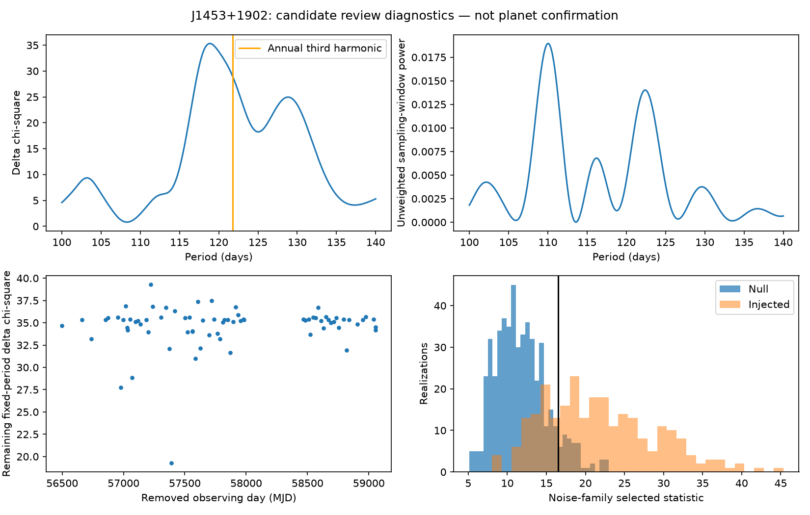
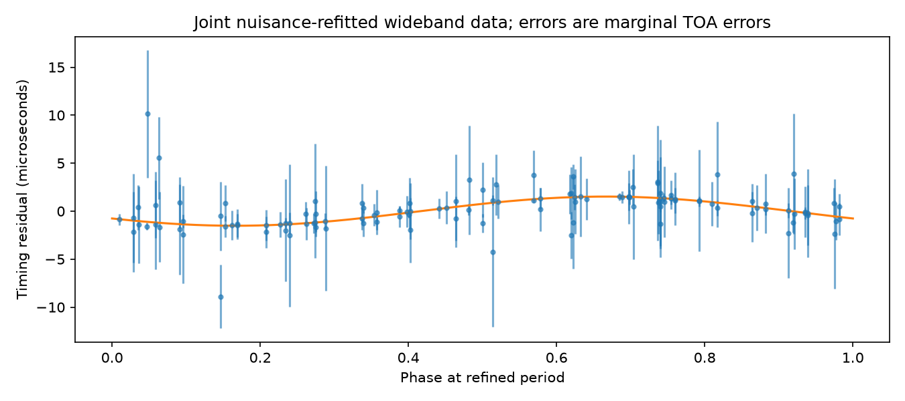
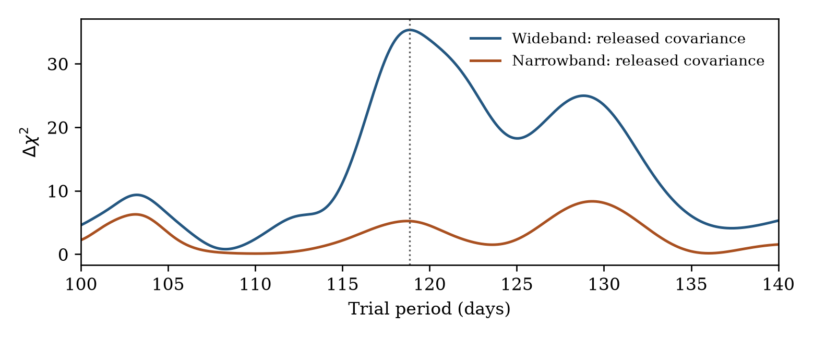

# A noise-sensitive periodic timing candidate in PSR J1453+1902

Project Recherche

Research report PR-J1453-2026-01 | Version 1.0 | 8 September 2026

## Abstract

We report the first periodic-signal candidate produced by Project Recherche in an unseeded search of observed pulsar-timing data and present its subsequent diagnostic review. A search of 16 isolated pulsars in the NANOGrav 15-year release identified PSR J1453+1902 as the sole threshold crossing. Its 122 wideband pulse times of arrival, accompanied by 122 dispersion-measure estimates over approximately seven years, yielded a peak at 118.4273 days with a timing amplitude of 1.5262 microseconds and a fit improvement Δχ² = 34.9142, exceeding the frozen threshold of 26.8265. Local refinement gives 118.8668 days and 1.5200 microseconds under the released covariance. The signal strength is sensitive to removal of individual observing days, and the later observations provide weaker support. In a bounded comparison allowing correlated timing noise, 46 of 512 noise-only simulations produce a search statistic at least as large as observed. The official narrowband reduction provides only weak support at the proposed period. We therefore retain the historical trigger but classify its astrophysical interpretation as inconclusive and noise-sensitive. Neither a planetary detection nor the absence of a planet is established. This case illustrates the distinction between a calibrated, conditional search trigger and robust evidence for an orbiting companion.

**Keywords:** pulsars: individual (PSR J1453+1902); pulsar timing; planetary systems; statistical methods; correlated noise

## 1. Introduction

Orbital motion can imprint a periodic light-travel-time delay on pulsar arrival times. Searching for such a signal requires separation of a possible companion's contribution from the pulsar timing model, propagation effects and instrumental noise. A statistically unusual residual pattern under one assumed covariance need not remain unusual when that covariance is reconsidered.

PSR J1453+1902 is a solitary millisecond pulsar with a spin period of about 5.79 ms. Lorimer et al. [1] presented a three-year timing study and found no significant planetary periodicities. Behrens et al. [2] subsequently searched the NANOGrav 11-year sample without detecting planets. J1453+1902 is consequently not a previously unexamined system; the novelty here is the candidate generated by Recherche's own unseeded search and its documented disposition.

This report describes a targeted follow-up of one selected candidate, not a new population analysis. The initial observed search and its frozen threshold are preserved. The subsequent local fits, subset comparisons and simulations are explicitly diagnostic. The report is a project research record; it has not undergone independent scholarly peer review.

---

## 2. Observations and initial search

### 2.1. Data and timing model

We use the primary PINT timing products in NANOGrav 15-year release v2.1.0 [3,4]. The wideband data for J1453+1902 contain 122 arrival times and 122 paired dispersion-measure (DM) measurements from Arecibo/PUPPI. The timing span is 2558.0287 days, from July 2013 to July 2020. The two radio-band groups comprise 49 measurements near 430 MHz and 73 at L band. The 73 distinct integer TDB observing days are an operational grouping, not a claim of independent noise samples.

The prepared residual vector contains the TOA residuals in seconds followed by the DM residuals in pc cm⁻³. The supplied covariance and design matrix retain this mixed-unit layout. The released timing, astrometric, instrumental-jump and dispersion terms contribute 82 independent nuisance columns, including 71 free DMX windows. The released wideband model has scaled white-noise and dispersion terms but no red-noise component. The broader NANOGrav noise analysis [5] motivates examining covariance assumptions rather than interpreting every periodic residual as an orbit.

Table 1. Input and search characteristics.

| Quantity | Value |
| Wideband TOAs / auxiliary DM measurements | 122 / 122 |
| Wideband observing days / span | 73 / 2558.0287 days |
| Full residual dimension / nuisance rank | 244 / 82 |
| Original period range | 30.0-1279.0144 days |
| Original grid cells / eligible cells | 418 / 404 |
| Pulsars in the frozen NG15 batch | 16 |
| Calibration null realizations per target | 4096 |
| Conditional batch false-alarm allowance | 0.01 |

### 2.2. Conditional generalized least-squares search

At each trial period P, the model is y = Xβ + H(P)a + ε, where X contains linear timing nuisance terms and ε has covariance C. The two columns of H are sin[2π(t - t₀)/P] and cos[2π(t - t₀)/P] on the TOA rows and zero on the auxiliary DM rows. The reference epoch is t₀ = 57777.0 MJD (TDB). Cholesky whitening and nuisance projection give the statistic Δχ² = χ²(null) - χ²(null + sinusoid). The timing amplitude is A = √(a₁² + a₂²).

The frozen calibration uses the larger of an empirical 99th percentile of null maxima and the Gaussian two-coefficient union bound 2 ln(BF/α), with B = 16 searches, F = 418 grid cells and α = 0.01. The bound conservatively counts masked cells and gives 26.8265. This allowance is conditional on the supplied covariance and fixed linear search; it is not the probability that a selected candidate is a planet, nor a project-wide error rate across all historical campaigns.

---

## 3. Targeted review methodology

### 3.1. Local refinement, aliases and data subsets

Before the review calculations, a 100-140-day interval with 801 grid points was declared. The maximum was refined continuously within the adjacent grid bracket. Local profile-likelihood envelopes use Δχ² losses of 1 and 3.84146. These intervals condition on the circular model, fixed covariance and prior candidate selection. We compared a 121.75-day annual third harmonic, calculated an unweighted sampling window, and repeated fits after dropping each integer observing day. The auxiliary DM rows and covariance were subset together with their associated TOAs, and surviving nuisance terms were refitted.

Early/late subsets were divided at the median unique observing day; radio-band subsets used a boundary of 800 MHz. For each partition, a joint fit compared one common sinusoid with separate sine/cosine coefficients for the two groups. The resulting two-parameter contrasts are descriptive checks at the selected period. No subset is independent of the discovery data, and the original threshold was not reused for these tests.

### 3.2. Fixed family of noise alternatives

Eight covariance choices were declared: the released covariance; four additional achromatic exponential kernels with correlation time 365 days and RMS amplitudes 0.5, 1, 2 and 4 microseconds; doubled auxiliary DM standard errors; and two additional chromatic kernels with correlation time 90 days and amplitudes 1 and 2 microseconds at 1400 MHz. The achromatic term is Kᵢⱼ = σ² exp(-|tᵢ - tⱼ|/τ). The chromatic term multiplies this expression by qᵢqⱼ, with qᵢ = (1400 MHz/νᵢ)⁴. These added kernels act on TOA rows. They are diagnostic covariance models, not established physical explanations for this pulsar.

For a fixed covariance, we use the timing-marginalized objective

Q = χ² + ln det C + ln det(Xₛᵀ C⁻¹ Xₛ),

where Xₛ uses the same fixed column normalization for all models. All eight comparisons retain timing rank 82. Linear timing coefficients are marginalized with a common flat-prior measure; sinusoidal coefficients and the discrete covariance choice are profiled. The family statistic is S = min Q(null) - min Q(signal), with covariance reselected separately under each hypothesis. This statistic is not a Bayesian planet-versus-no-planet evidence ratio.

### 3.3. Bounded simulation and alternate reduction

One exercise used seed 2026092201: 512 Gaussian null realizations and 256 signal injections, generated with the selected null covariance and actual sampling. Each realization repeated timing projection, period maximization and discrete covariance selection. The search used the union of the original eligible frequencies and the local refinement grid. Injections used the refined phase and amplitude; they assess conditional recovery, not observed detections. Finally, the official primary narrowband reduction was examined at the selected period and over the same local interval using its full released EFAC/EQUAD/ECORR covariance. Shared observations prevent that reduction from serving as independent confirmation.

---

## 4. Results

### 4.1. Initial trigger, refinement and observing-day influence

The independent diagnostic GLS implementation reproduces the stored initial Δχ² = 34.914232612986 to numerical precision. The null χ² is 203.6758 for 162 degrees of freedom (reduced χ² = 1.2573). Its upper-tail probability is 0.0147. The predefined broad noise flag, which required reduced χ² ≥ 2, did not fire; this does not demonstrate adequate modeling of all noise components.

The refined maximum is P = 118.8668263 days, A = 1.519994 microseconds and Δχ² = 35.319055. Local 68% and 95% profile envelopes are 118.20-119.70 and 117.60-120.95 days, respectively, at 0.05-day resolution. The 121.75-day harmonic gives Δχ² = 29.051484. Adding the candidate after that harmonic improves the fit by 10.035830, while the reverse addition gives 3.768260. This favors the refined period within the tested fixed-noise comparison, without excluding all annual or sampling-related explanations.

Figure 1. Saved wideband review diagnostics. Upper left: local periodogram and the annual third harmonic. Upper right: unweighted observing-window power. Lower left: the fixed-period statistic after each observing day is removed. Lower right: noise-family-selected statistics for 512 null and 256 injected realizations; the vertical line marks the observed value. These are conditional diagnostic distributions, not a recalibration of the original campaign threshold.

The leave-one-day-out statistic ranges from 19.2720 to 39.3009. Removing MJD 57389, containing three TOAs, produces the largest decrease. Refined subset periods remain between 118.05 and 119.25 days. Thus, local period stability coexists with substantial sensitivity of signal strength to one observing day.

---

### 4.2. Time and radio-band consistency

Table 2 lists separate subset fits at 118.8668263 days. Their amplitudes should be interpreted together with the coefficient uncertainties and nuisance freedom. In particular, dispersion fitting substantially reduces the information available to either radio band alone.

Table 2. Descriptive fixed-period subset results under the released covariance.

| Subset | TOAs | Amplitude (μs) | Δχ² |
| Early observations | 65 | 1.950 | 25.424 |
| Late observations | 57 | 0.527 | 1.656 |
| 430 MHz | 49 | 37.627 | 1.205 |
| L band | 73 | 3.211 | 3.860 |

The 430-MHz sine and cosine coefficient uncertainties are approximately 39 microseconds each. Its large best-fit amplitude is therefore poorly constrained, rather than evidence for a larger orbital delay. Full coefficient covariance matrices are retained in the machine-readable review results.

Joint common-versus-split fits improve Δχ² by 3.2373 for the time partition and 4.5449 for the radio-band partition. With two additional coefficients, the corresponding fixed-period consistency probabilities are 0.198 and 0.103. Neither contrast establishes strong inconsistency. Nevertheless, the later data are much less supportive, and the band-only fits do not independently corroborate the original trigger. Limited subset sensitivity prevents a simple interpretation of these weak fits as rejection of an orbit.

Figure 2. Wideband TOA residuals folded at the refined period after joint refitting of nuisance parameters with the sinusoid. The curve is the fitted circular timing signal. Error bars are marginal TOA uncertainties, not uncertainties after propagation of the fitted timing parameters. The visualization is conditional on the selected model and uses all discovery observations; it is not an independent validation plot.

---

### 4.3. Sensitivity to the noise model

The preferred null covariance includes an achromatic exponential component with RMS 2 microseconds and a 365-day correlation time. The preferred signal covariance uses RMS 1 microsecond. Their difference gives S = 16.499974. The null correlated-noise model improves Q by 21.963 relative to the released model. At the candidate period, the fixed 2-microsecond covariance yields Δχ² = 11.509, substantially below its released-covariance value.

Table 3. Noise-family comparison. Both objective columns are relative to Q for the released null model; smaller values are preferred. Peak periods are selected over the full diagnostic search grid. The final column evaluates the fixed 118.8668-day candidate.

| Covariance choice | Q(null) | Q(signal) | Peak P (d) | Δχ² at candidate |
| Released | 0.000 | -35.319 | 118.867 | 35.319 |
| Achromatic, 0.5 μs | -10.871 | -38.141 | 118.867 | 27.270 |
| Achromatic, 1 μs | -19.002 | -38.463 | 118.867 | 19.460 |
| Achromatic, 2 μs | -21.963 | -33.472 | 118.850 | 11.509 |
| Achromatic, 4 μs | -15.085 | -20.744 | 118.500 | 5.613 |
| Doubled DM errors | 76.828 | 41.005 | 118.950 | 35.806 |
| Chromatic, 1 μs | 55.754 | 49.029 | 45.517 | 2.244 |
| Chromatic, 2 μs | 113.164 | 105.960 | 45.355 | 3.100 |

Among the 512 noise-only searches, 46 have S at least as large as observed. The plus-one tail estimate is (46 + 1)/(512 + 1) = 0.091618. This is a plug-in, single-target diagnostic conditional on the selected generative covariance and limited model family. It is not a posterior probability that the candidate is false, and the simulation count is insufficient to establish the small tail associated with the original batch-wide search allowance.

Of the 256 injected realizations, 197 (77.0%) recover the period within two days and 188 (73.4%) exceed the observed statistic. These results demonstrate useful but incomplete sensitivity to the adopted signal under the tested noise model. They do not validate the signal in the real observations. The distinction is especially important because the injection amplitude and phase were estimated from those observations.

### 4.4. Official narrowband reduction

The alternate reduction contains 2551 channelized TOAs over 71 observing days within the same 2013-2020 span. Its released covariance includes EFAC, EQUAD and ECORR, and its timing design has rank 78. The null χ² is 2437.8556 for 2473 degrees of freedom. No fitted noise waveform was subtracted before the comparison.

At 118.8668 days, the narrowband fit gives Δχ² = 5.220176 and A = 1.100421 microseconds. Its strongest peak in the 100-140-day interval is at 129.35 days with Δχ² = 8.331190 (Figure 3). This is weak reproduction of the proposed signal. Because no narrowband detection threshold was calibrated, this diagnostic is not entered as a new survey nondetection.

---

## 5. Discussion and conclusions

Figure 3. Local periodograms from the wideband and narrowband reductions, each using its own released covariance and nuisance model. The dotted line marks the refined wideband period. The two curves use shared observations and are not statistically independent. No common detection threshold is asserted for these diagnostic scans.

The initial threshold crossing is reproducible under its stated assumptions. Its astrophysical interpretation is less secure: correlated timing noise reduces its prominence, later observations contribute weaker evidence, one observing day has substantial influence, and the alternate reduction does not strongly reproduce the peak. The subset consistency tests do not by themselves disprove a coherent orbit, but neither do they resolve these limitations. The covariance alternatives are intentionally bounded and should not be interpreted as a complete physical noise model or a unique diagnosis of the trigger's origin.

No new planetary discovery is claimed. The appropriate present disposition is **inconclusive and noise-sensitive**, while preserving the original candidate as a historical search result. The original threshold has not been changed, and the review does not establish the absence of a companion. Earlier null studies [1,2] provide context rather than a direct contradiction: observations, noise assumptions, sensitivity definitions and selection procedures differ.

A bounded public-data check acquired no additional calibrated J1453+1902 timing series. The NANOGrav catalog [6] lists the 15-year release as its latest primary timing dataset. The verified CPTA catalog describes FAST observations from 2019 to 2022, but its public access link supplies polarization data [7]. The noise-analysis supplement linked by Chen et al. [8] exposes a plots archive in its metadata; no directly accessible PAR/TIM series was verified there. These findings describe this acquisition attempt, not the universal absence of other observations.

The next scientifically useful step would be to acquire additional calibrated TOAs with uncertainty and noise information, preferably from another observatory or nonoverlapping epochs. A prediction should be frozen before evaluating those data, with instrument offsets and propagation effects treated explicitly. Repeatedly altering the search of the existing sample would not provide independent evidence. For now, this candidate should remain documented and parked rather than promoted to a planetary interpretation.

---

## 6. Reproducibility, data availability and contributions

The numerical review is recorded at repository commit **a4f56a4**. The report was assembled from its saved results without rerunning searches or simulations. The scientific calculations used the pinned Intel Pixi Python environment, one numerical-library thread, PINT timing preparation, DE440 and BIPM2019. Qualified scientific source files and the original search calibration were preserved. All 231 historical search/refinement result files were verified against their saved hashes during review closeout.

The repository contains the master workbook, this report and its editable source, diagnostic figures, the local periodogram comparison table, the targeted review scripts, and machine-readable step records. The raw release is available from Zenodo [4]; full prepared arrays and resource bundles remain outside Git. A fresh clone alone is therefore not a self-contained numerical reproduction package. The closeout manifest identifies external artifact paths and hashes. The workbook preserves the original trigger and adds the final review disposition; its count of one periodic candidate is not a count of confirmed planets.

Primary review code: tools/j1453_review.py and tools/j1453_narrowband_review.py. Evidence prefix: results/research/j1453-human-review-20260908-. Full review narrative: docs/J1453_HUMAN_REVIEW_2026-09-08.md. Dataset archive SHA-256: 91476bf20d4c8baa9f5ad39c6e114b581478a5a7e269876489cafc8f62c5708f. Original candidate-result SHA-256: 975c9baf7109cf683b00d2f882bbf531bc52a37aac47d1d1228152d4f8fc8436.

**Contributions and acknowledgments.** Project direction and review authorization were provided by John Fadool. Codex performed the computational review, inspected the diagnostic plots and prepared this report. No independent astronomer sign-off or journal acceptance is implied. We acknowledge the NANOGrav collaboration and the cited authors for making observations, timing products and research available.

## References

[1] Lorimer, D. R., et al. (2007). PSR J1453+1902 and the radio luminosities of solitary versus binary millisecond pulsars. Monthly Notices of the Royal Astronomical Society, 379, 282-288. https://doi.org/10.1111/j.1365-2966.2007.11946.x

[2] Behrens, E. A., et al. (2020). The NANOGrav 11-year Data Set: Constraints on Planetary Masses Around 45 Millisecond Pulsars. Astrophysical Journal Letters. https://arxiv.org/abs/1912.00482

[3] Agazie, G., et al. (2023). The NANOGrav 15-year Data Set: Observations and Timing of 68 Millisecond Pulsars. Astrophysical Journal Letters. https://doi.org/10.3847/2041-8213/acda9a

[4] NANOGrav Collaboration. The NANOGrav 15-Year Data Set, v2.1.0. Zenodo data release. https://doi.org/10.5281/zenodo.16051178

[5] Agazie, G., et al. (2023). The NANOGrav 15-Year Data Set: Detector Characterization and Noise Budget. Astrophysical Journal Letters. https://doi.org/10.3847/2041-8213/acda88

[6] NANOGrav. Public data catalog. Accessed 8 September 2026. https://nanograv.org/science/data

[7] CPTA Collaboration / National Astronomical Data Center. The Chinese pulsar timing array data release I. Public polarimetry catalog, accessed 8 September 2026. https://doi.org/10.12149/103117

[8] Chen, S., et al. (2025). The Chinese Pulsar Timing Array Data Release I: Single pulsar noise analysis. Astronomy & Astrophysics, 699, A165. https://doi.org/10.1051/0004-6361/202452550 . Supplement: https://doi.org/10.5281/zenodo.13828113
