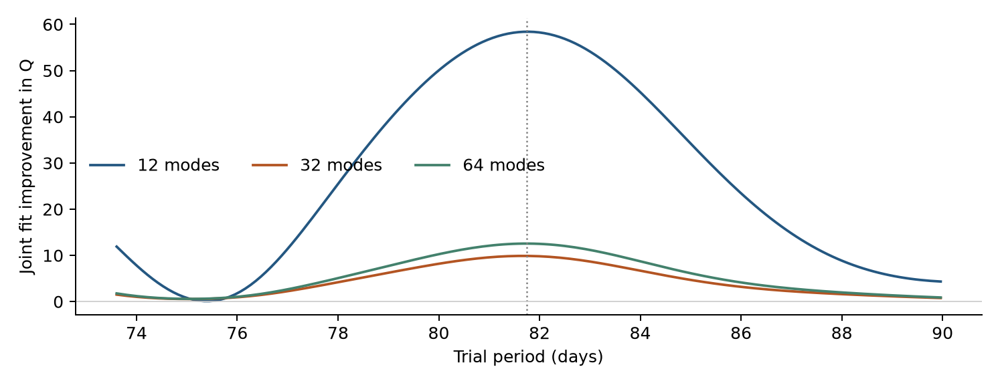
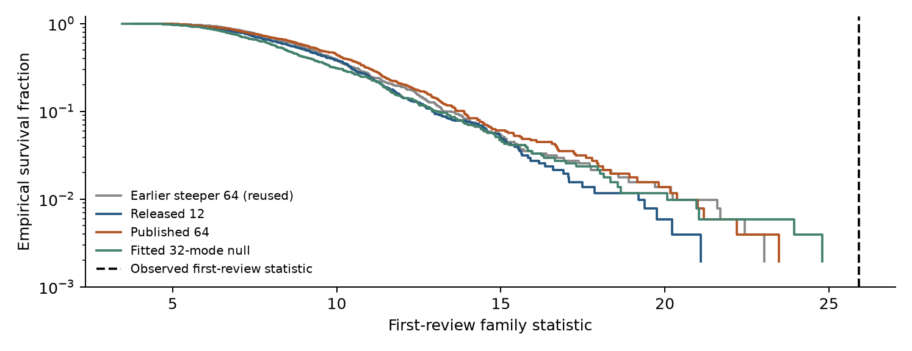
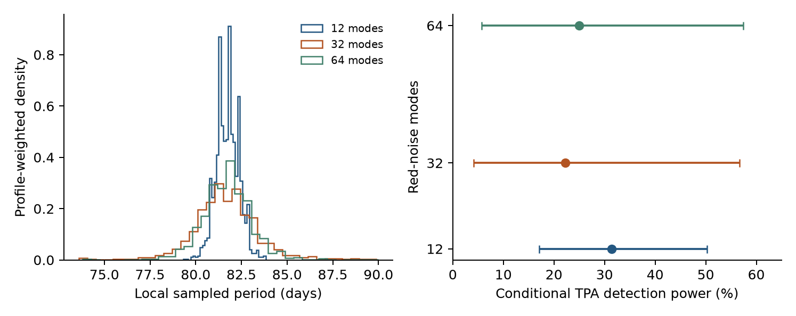

# Noise-model dependence of an 81.75-day timing feature in PSR J1752-2806

Project Recherche

Research report PR-J1752-2026-01 | Version 1.0 | 9 September 2026

## Abstract

We investigate the periodic timing feature identified in PSR J1752-2806 during Project Recherche's fourth UTMOST batch. The original search of 145 pulse times of arrival spanning 1459.83 days produced an 81.785-day peak with timing amplitude 137.20 microseconds and fit improvement Δχ² = 57.672, above the frozen conditional threshold 26.498. A first bounded review found persistence under individual observing-day removal and compatible early/late coefficients, but strong dependence on red-noise coverage. We extend that review with joint signal/noise fits, additional noise-generating models, and uncertainty propagation to independent MeerKAT observations. Continuous fits retain periods near 81.7 days, while the improvement drops from 58.42 with 12 red-noise modes to 9.89 and 12.56 with 32 and 64 modes. The earlier finite-family statistic is exceeded by none of 512 null simulations under each of four declared generators, including one previously completed ensemble. These conditional diagnostics do not calibrate the continuous-fit statistic or establish survey-wide significance. Propagated period/coefficient uncertainty yields median conditional detection power of 22-31% in the independent data. We retain an inconclusive, noise-sensitive periodic candidate. The available evidence establishes neither a planet nor its absence.

**Keywords:** pulsars: individual (PSR J1752-2806); pulsar timing; periodic signals; correlated noise; planetary searches

## 1. Scientific question and evidence boundary

A coherent-looking timing residual can arise from orbital motion or an incomplete model of the pulsar, propagation path or instrument. The question here is whether the approximately 81.75-day feature remains distinguishable when the red-noise model is allowed to describe variability at the candidate period. Its survival under time and observing-day checks motivates investigation, but cannot determine its physical origin.

UTMOST batch 04 comprised 25 source-separated searches: 21 NO_TRIGGER results and four original crossings [1]. All four received a bounded review. J1752-2806 was selected for the present dedicated report because of its time consistency, stronger original statistic and unusually small conditional simulation tail. The selection is itself part of the search history; no discovery significance is assigned by treating this target as prespecified before the campaign.

This agent-assisted project report is privately retained and has not undergone independent scholarly peer review. Original observations and their published interpretation remain attributable to the source teams. All new numerical work described here is a follow-up of the consumed search, not a new blind survey.

---

## 2. Observations and analysis protocol

### 2.1. Source data

We use the already prepared public UTMOST DR1 observations and timing/noise model associated with Lower et al. [2,3]. The source covariance applies the released white-noise parameters and a Fourier power-law red process. Timing nuisance columns represent an offset, position, spin frequency and its first two derivatives. The prepared design has rank six. The effectively single observing band does not permit independent separation of achromatic orbital delays from dispersion or scattering variability.

The independent comparison uses the previously searched TPA DR1 observations from MeerKAT [4,5]. The two observing spans do not overlap. The TPA timing and frequency-dependent nuisance model and covariance are reused without another blind search or recalibration.

Table 1. Bound inputs and original result.

| Quantity | Value |
| UTMOST TOAs / observing days | 145 / 130 |
| UTMOST MJD range | 56967.383-58427.209 |
| TPA TOAs / observing days | 400 / 50 |
| TPA MJD range | 58787.784-60047.162 |
| Original search range | Eligible circular periods, 30-400 days |
| Original statistic / threshold | 57.6719 / 26.4980 |
| Original peak period / amplitude | 81.7850 days / 137.196 microseconds |
| Released log10 red amplitude / index | -9.72688 / 1.89388 |
| Released Fourier modes | 12 sine/cosine pairs |

### 2.2. Follow-up model and declared limits

The residual vector is modeled as y = Xb + H(P)a + n, where X contains linear timing nuisance terms and H contains sine and cosine at trial period P. The noise has covariance C = W + C_red(A, γ, M); W remains fixed. We use the existing red-noise normalization and Fourier frequencies f_k = k/T, for k = 1,...,M and T equal to the observed span. Red power scales as A² f^(-γ).

For fixed covariance and period we project X and profile the two sinusoid coefficients. To compare noise choices we minimize Q = χ² + log det C + log det(X_sᵀ C⁻¹ X_s), with the same column-normalized timing design X_s in every model. This marginalizes linear timing terms with a common flat-prior measure and profiles the sinusoid. It is neither a signal Bayes factor nor a calibrated discovery statistic.

The saved scope declares M = 12, 32, 64, log10 A within one dex of its released value, γ in [0,7], and P in [73.6065,89.9635] days. Each period profile has 161 samples with noise refitted, followed by local joint refinement. Multistart fits check the noise optimum. No reported optimum reaches a noise bound, and each local ΔQ = 3.84 support envelope is interior to the period interval. This is local candidate characterization, not a search for a replacement period elsewhere.

---

## 3. Joint signal and red-noise fits

The released 12-mode basis has shortest Fourier period T/12 = 121.65 days. It therefore has no explicit red-noise Fourier component at 81.75 days, although irregular sampling permits spectral leakage. The 32- and 64-mode bases extend to 45.62 and 22.81 days and directly cover the candidate frequency region. This difference is a concrete explanation for examining red-noise truncation; it does not prove that the candidate is noise.

Table 2. Jointly fitted noise and circular signal. Improvement is Q_null,min minus Q_signal,min within each basis. Amplitudes are timing delays, not companion radii.

| Quantity | 12 modes | 32 modes | 64 modes |
| Best period (days) | 81.7609 | 81.6702 | 81.7346 |
| Timing amplitude (microseconds) | 138.09 | 122.35 | 126.91 |
| Joint improvement in Q | 58.42 | 9.89 | 12.56 |
| Fitted null log10 A / γ | -9.689 / 2.268 | -9.685 / 3.050 | -9.646 / 3.344 |
| Fitted signal log10 A / γ | -9.703 / 2.484 | -9.683 / 3.455 | -9.663 / 3.654 |
| Local ΔQ ≤ 3.84 envelope (days) | 80.66-82.91 | 78.92-84.24 | 79.43-83.93 |

Figure 1. Improvement over the independently optimized null in each Fourier basis, with noise parameters refitted at every period. The vertical dotted line marks the first-review refinement. No original discovery threshold is applied to these changed-noise profiles.

The period location and approximate amplitude persist, but the evidence for a separate periodic component weakens substantially with broader noise coverage. After jointly selecting the basis under both hypotheses, the best null has 32 modes and the best signal has 12 modes, giving an overall local objective improvement of 20.94. That value remains uncalibrated. The ΔQ = 3.84 envelopes describe local profile support; they are not validated 95% confidence intervals after candidate selection or noise-model choice.

The original observing-day and time checks are retained rather than repeated: minimum day-deletion Δχ² was 49.31, and the fixed-period early/late consistency diagnostic was p = 0.752 [1]. These checks use the original covariance and cannot establish robustness to the new noise fits.

---

## 4. Sensitivity of the earlier simulation result

The first review compared its candidate statistic 25.908 with simulated maxima over the original eligible grid plus local refinement. The same eight-member finite noise family was reselected under null and signal in every realization [1]. Its 512 simulations used one fitted steeper 64-mode noise generator and had zero exceedances.

We now retain that ensemble and generate 512 additional null realizations from each of three declared covariances: the released covariance, the published power law extended to 64 modes, and the best continuous noise-only fit from Section 3. We rerun the **first review's finite-family selection procedure** on each realization. We do not refit the continuous noise parameters in these simulations; they therefore do not calibrate the new joint-fit statistic 20.94.

Table 3. Conditional tail checks of the same earlier observed statistic.

| Noise generator | Exceedances | Status |
| Steeper 64-mode first-review null | 0 / 512 | Reused |
| Released 12-mode covariance | 0 / 512 | New |
| Published power law, 64 modes | 0 / 512 | New |
| Best continuous null, 32 modes | 0 / 512 | New |

Figure 2. Empirical survival curves for the earlier finite-family statistic under each declared noise generator. The dashed line is the observed value 25.908. Curves stop at each sample maximum; no zero-probability tail is extrapolated beyond the simulations.

Each ensemble has plus-one tail estimate (k+1)/(N+1) = 1/513 = 0.195%. Counts from different generators are not pooled. Zero exceedances at this resolution does not measure a zero false-alarm probability. Repeated testing across targets, periods, datasets and model choices, and uncertainty beyond these four generators, prevent interpreting this result as a survey-wide probability or equivalent discovery sigma [6]. The additional ensembles support the limited finding that the earlier result is not peculiar to its single chosen generator.

The original injection check recovered the period within two days in 151/256 realizations, but only 17/256 exceeded the observed family statistic. That low exceedance power is retained as a limitation of the procedure. No further injections were run merely to improve these numbers.

---

## 5. Propagating uncertainty into the TPA comparison

The first review fixed the period and coefficients at their UTMOST estimates. Under that exact waveform the TPA observations had 29.0% conditional power for a fixed-period test at α = 0.01. The observed TPA fixed-period statistic was only 0.0415. Because the observations are later and non-overlapping, period uncertainty can accumulate into substantial phase uncertainty.

For each of the three joint noise-basis fits, we form local period weights proportional to exp[-(Q(P)-Q_min)/2] on the uniform declared grid. We draw 2,048 periods and, conditional on each selected period and its fitted noise parameters, draw sine/cosine coefficients from the GLS Gaussian covariance. This retains period/coefficient dependence. It is a profile-weighted uncertainty approximation, **not a marginalized Bayesian posterior**: noise-parameter uncertainty within a basis, white-noise uncertainty and prior-volume factors are not integrated.

Each drawn waveform is propagated using the same reference epoch to the TPA observing times and projected through the saved TPA nuisance design. Its detection power follows the noncentral two-coefficient fixed-period statistic under the fixed TPA covariance. The quantities below describe sensitivity to assumed waveforms; they are not planet probabilities or an averaged significance.

Table 4. Propagated conditional detection power. Brackets enclose the 5th-95th percentiles across parameter draws, not a frequentist confidence interval on power.

| Noise basis | Median power | Draw percentile range |
| 12 modes | 31.4% | 17.1-50.2% |
| 32 modes | 22.2% | 4.1-56.7% |
| 64 modes | 25.0% | 5.7-57.4% |

Figure 3. Left: local profile-weighted period draws for each noise basis. Right: median and 5th-95th percentile conditional TPA power. Broader uncertainty does not turn these measurements into a decisive confirmation test.

Phase coherence also degrades across the extrapolation. For the 32-mode fit, the circular resultant length at the first, median and last TPA dates is 0.450, 0.098 and 0.029, respectively; a value near zero indicates widely dispersed predicted phases. Approximately 67-75% of drawn waveforms fall within the TPA 95% coefficient ellipse at their respective periods, a descriptive overlap measure rather than a calibrated test. The independent observations remain **UNDERPOWERED** and do not resolve the candidate.

---

## 6. Interpretation and disposition

Three findings survive this focused review. First, a local periodic feature near 81.7 days persists in joint fits, with fitted timing amplitudes about 122-138 microseconds. Second, its separation from stochastic timing structure depends strongly on the Fourier noise basis: the strongest evidence occurs when the red process lacks explicit modes at the candidate frequency. Third, the earlier finite-family simulation diagnostic remains unusual under the four tested generators, while independent TPA measurements remain insufficiently sensitive after uncertainty propagation.

These findings justify preserving J1752-2806 as a documented follow-up target. They do not establish an orbital interpretation. The current evidence grades remain **statistical significance: NOT_ESTABLISHED; signal robustness: NOISE_SENSITIVE; independent confirmation: UNDERPOWERED**. The scientific disposition is **INCONCLUSIVE_NOISE_SENSITIVE**.

A future decisive study would require more informative independent timing observations and a noise model with supported coverage at the candidate period. A global significance claim would additionally require calibration of the actual model-fitting and search procedure over the relevant selection history. The present work stops at its declared boundary. Further blind searches, unrestricted noise exploration and additional simulation campaigns have not been launched.

## References

[1] Project Recherche (2026). UTMOST batch 04 closeout and four-candidate bounded review; original result, frozen calibration, observing-day/time checks and simulation evidence. Repository documents: docs/UTMOST_BATCH04_2026-09-09.md and docs/UTMOST_BATCH04_CANDIDATE_REVIEWS_2026-09-09.md.

[2] Lower, M. E., et al. (2020). The UTMOST pulsar timing programme II: Timing noise across the pulsar population. MNRAS 494, 228. https://arxiv.org/abs/2002.12481

[3] Molonglo Observatory. UTMOST pulsar timing programme open data, TimingDataRelease1. Bound local snapshot used; no refreshed observations ingested for this follow-up. https://github.com/Molonglo/TimingDataRelease1

[4] Keith, M. J., et al. (2024). The Thousand-Pulsar-Array programme on MeerKAT XIII: Timing, flux density, rotation measure and dispersion measure timeseries of 597 pulsars. MNRAS 530, 1581. https://arxiv.org/abs/2404.02051

[5] Keith, M. J., et al. (2024). MeerTime Thousand Pulsar Array Data Release, version 1. Zenodo. https://doi.org/10.5281/zenodo.8430591

[6] Particle Data Group (2020). Statistics review, especially nuisance parameters, significance and the look-elsewhere effect. https://pdg.lbl.gov/2020/reviews/rpp2020-rev-statistics.pdf

## Reproducibility and provenance

The original UTMOST result and first review are consumed records. New scope, joint fits, null-generator diagnostics and uncertainty propagation are stored in results/research/j1752-focused-review-20260909/. Scope JSON binds the prepared UTMOST and TPA arrays, original result and earlier simulation arrays by SHA-256. Numerical code is tools/j1752_focused_review.py, run in the pinned Intel Python environment with one numerical thread. Code and evidence hashes, workbook update receipts and report hashes accompany the closeout. The master contains the updated assessment while retaining its prior manifest and all original scientific rows.

The focused extension performed 1,536 new null realizations and 6,144 local parameter draws. Earlier 512 nulls and 256 injections were reused as evidence. Reconstructed source covariance and independent template-power calculations agreed with saved values. The qualified search solver, original threshold and earlier scientific outputs were preserved. Report preparation and plotting read saved numerical results and do not repeat the science.
