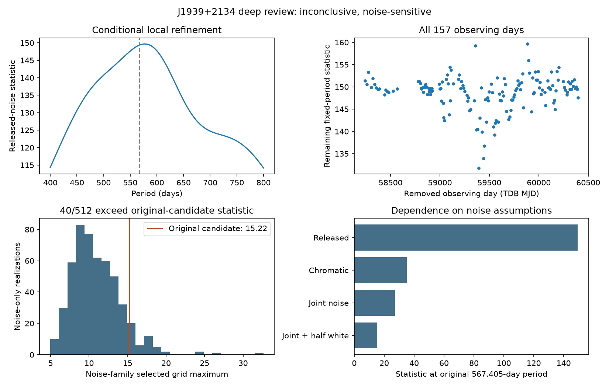

# A bounded noise and cross-source review of the periodic timing candidate in PSR J1939+2134

Project Recherche

Research report PR-J1939-2026-01 | Version 1.0 | 9 September 2026

## Abstract

We present a targeted review of the PSR J1939+2134 periodic-signal candidate identified by Project Recherche in public Indian Pulsar Timing Array (InPTA) observations. The original conditional search of 18,191 pulse times of arrival over 157 observing days yielded a 567.405-day peak with timing amplitude 1.786 microseconds and fit improvement Δχ² = 149.353, above its frozen threshold of 26.713. We assessed a fixed family of 16 white, achromatic and frequency-dependent noise models, performed 512 noise-only simulations and 256 injections, removed every observing day individually, and compared receiver bands and overlapping Parkes Pulsar Timing Array (PPTA) observations. Noise-model profiling reduces the statistic at the original period to 15.223; 40 of 512 noise-only searches produce a grid maximum at least this large, giving a conditional plus-one diagnostic estimate of 0.0799. The released-noise signal survives every single-day removal, but band consistency and overlapping-source comparisons weaken a common stationary timing-delay interpretation. A different residual maximum near 66.961 days remains unexplained under the finite noise family and is explicitly distinguished from the original candidate. We retain the historical trigger and classify its planetary interpretation as inconclusive and noise-sensitive. Neither a planet nor the absence of a planet is established.

**Keywords:** pulsars: individual (PSR J1939+2134); pulsar timing; planetary systems; correlated noise; statistical methods

## 1. Introduction

A periodic timing residual can arise from orbital motion, propagation effects, instrumental behavior or an incomplete description of stochastic noise. A threshold crossing under an assumed covariance therefore warrants follow-up before it can support a planetary interpretation. The relevant question is whether a common timing delay persists across defensible noise assumptions, observing epochs and independent measurements.

Recherche's combined PPTA, EPTA and InPTA campaign searched 18 source datasets from 12 isolated pulsars [1]. After documented import corrections, 17 datasets produced no qualifying trigger and the InPTA J1939+2134 dataset retained one conditional candidate. The present report describes its bounded follow-up [2]. It preserves the original search and uses saved diagnostic evidence; preparing this PDF did not execute additional scientific scans or simulations.

This is an agent-assisted project research report. Its numerical verification and provenance do not constitute independent scholarly peer review. The project and this report remain private.

---

## 2. Observations and initial search

### 2.1. Source data and nuisance model

The InPTA DR2 repository supplies arrival-time files and timing models from uGMRT Band 3 (300-500 MHz) and Band 5 (1260-1460 MHz) [3]. Recherche's input snapshot is pinned to commit e2806fcb2c238ec38dd80784dfcb1e6c82f54728. The prepared J1939+2134 data contain 18,191 TOAs spanning 2156.1406 days. Integer TDB observing days define 157 influence groups; these groups are not asserted to be statistically independent.

The original prepared covariance is diagonal, with the release's EFAC-scaled uncertainties. The linear nuisance design has rank 165 and includes timing, astrometric and DMX dispersion terms. Data-derived DMX estimates are projected as nuisance parameters. The residual degrees of freedom are 18,026; the original reduced chi-square is approximately 0.215. This low value motivates scrutiny of the uncertainty model and does not establish an adequate stochastic description.

Table 1. Fixed data and review characteristics.

| Quantity | Value |
| InPTA TOAs / observing days | 18,191 / 157 |
| InPTA span | 2156.1406 days |
| Nuisance rank / residual degrees of freedom | 165 / 18,026 |
| Low-band / high-band TOAs | 17,765 / 426 |
| Original candidate period / amplitude | 567.4054 days / 1.7861 microseconds |
| Original statistic / frozen threshold | 149.3534 / 26.7127 |
| Local review interval / spacing | 400-800 days / 0.5 day |
| Noise choices / Fourier frequencies per process | 16 / 30 |
| Noise-only simulations / injections | 512 / 256 |
| Simulation seed | 2026092401 |

### 2.2. Preserved conditional search

The observed model is y = Xβ + H(P)a + ε, with linear timing design X, residual covariance C, and sine/cosine columns H at trial period P. Generalized least squares gives Δχ² = χ²(null) - χ²(null + sinusoid). The fitted timing amplitude is A = √(a₁² + a₂²). The shared reference epoch for this review is 58999.99975414959 MJD (TDB).

The original 30-1078.0703-day search was calibrated within an 18-dataset campaign using a shared 1% conditional false-alarm allowance, the fixed projection mask and 4,096 null realizations per dataset. The threshold remains attached to that original covariance and grid. It is not applied to data subsets or to the alternative-noise statistic used in this report.

---

## 3. Bounded follow-up methodology

### 3.1. Noise family and likelihood

The declared family contains eight covariance alternatives, each evaluated with white standard deviations scaled by either 1 or 0.5. The latter is a diagnostic alternative motivated by the initial low reduced chi-square, not an independently calibrated uncertainty correction. Each additional process uses 30 Fourier frequencies fₖ = k/T over the full InPTA span. Spectral weights proportional to k⁻γ are normalized so the sum of sine/cosine pair variances equals the quoted process RMS squared.

Table 2. Eight added-process choices, each combined with both white-error scales.

| Process choice | Spectral index and RMS |
| No additional process | Released white covariance only |
| Achromatic red process | γ = 2; RMS 1 microsecond |
| Achromatic red process | γ = 4; RMS 1 microsecond |
| Achromatic red process | γ = 4; RMS 2 microseconds |
| Achromatic red process | γ = 4; RMS 4 microseconds |
| Dispersion-like process | γ = 2; RMS 1 microsecond at 400 MHz; ν⁻² |
| Chromatic process | γ = 2; RMS 1 microsecond at 400 MHz; ν⁻⁴ |
| Joint process | Red γ = 4, RMS 2; both chromatic processes, RMS 1 each |

Fourier Gaussian-process representations are established in PTA analysis [5,6]. The finite amplitudes, white-error alternatives and RMS normalization above are specific diagnostic choices. They are neither inferred physical noise parameters nor an exhaustive set of possible propagation and instrumental effects. Existing free DMX terms can absorb much of an added dispersion-like process.

With C = D + UUᵀ, exact Woodbury identities evaluate the likelihood without repeatedly factoring an 18,191-square dense matrix. Linear timing coefficients are marginalized with a common prior measure. Model selection minimizes Q = χ² + ln det C + ln det(Xₛᵀ C⁻¹ Xₛ), omitting a common constant. Sinusoidal coefficients and the discrete noise choice are profiled; the noise choice is reselected separately under null and signal. This is not a Bayesian planet-versus-no-planet evidence ratio. A small dense comparison verifies the likelihood, template Gram matrix and determinant algebra, and the original observed statistic is independently reproduced.

### 3.2. Simulations and consistency diagnostics

The review searches the union of the original eligible grid and 400-800 days at 0.5-day spacing. A fixed seed generates 512 Gaussian noise-only realizations and 256 injections from the selected null covariance. Every realization repeats noise-model selection and period maximization. Injections use the released-noise refined phase and amplitude; recovery is assessed within 30 days of the injected period.

All 157 observing days are deleted individually at the refined fixed period, with surviving nuisance parameters refitted. Two direct fits check the sufficient-statistic deletion calculation. Time subsets divide at the median unique observing day; receiver subsets divide at 1000 MHz, between the actual observing bands. Joint fits compare shared and separate sine/cosine coefficients. PPTA DR3 [4] is evaluated at the same refined period in its full dataset and in the common observing window, retaining its own covariance and timing model.

---

## 4. Candidate strength and observing-day influence

The diagnostic implementation reproduces Δχ² = 149.3533928374 at the original 567.4054-day period. Under the released covariance, local refinement gives 577.5 days, amplitude 1.7974 microseconds and statistic 149.6675. This is a conditional local maximum after candidate selection, not a separately calibrated discovery or a model-independent period estimate.

Removing each observing day in turn gives remaining fixed-period statistics from 131.7929 to 159.6295. Thus the released-noise signal is not driven by one observing day. The original threshold is not reused to assign significance to these subsets. Annual and two-year fits were also retained as descriptive alias checks; astrometric projection makes the annual amplitude poorly constrained. No categorical exclusion of timing-model or sampling aliases is claimed.

Figure 1. Saved J1939+2134 review diagnostics. Upper left: the released-noise local periodogram; the dashed line marks the original grid period. Upper right: remaining statistic after each of 157 observing days is removed. Lower left: the global-maxima distribution from 512 noise-only simulations; the vertical line marks the revised statistic at the original candidate period. Lower right: dependence of that candidate statistic on selected noise assumptions. These panels do not establish a planet or recalibrate the original campaign threshold.

The preferred null covariance is the joint red, dispersion-like and ν⁻⁴ model with white standard deviations scaled by 0.5. At the original candidate period, its fitted amplitude is 0.7684 microseconds and its statistic is 15.2229. The large change from the released-noise fit demonstrates sensitivity to the assumed covariance, even though the single-day influence test remains stable.

---

## 5. Noise simulations and the distinct residual maximum

### 5.1. The original 567-day candidate

The candidate-specific statistic is S(P₀) = min Q(null) - min Q(signal at P₀), where P₀ is the original 567.4054-day period and each minimum profiles the noise family. To account conservatively for searching multiple periods, we compare this observed value with each simulated realization's maximum over the complete declared grid. The calculation reuses the saved simulations; it does not generate a second experiment after inspecting the first.

Forty of 512 noise-only maxima equal or exceed S(P₀) = 15.2229. The plus-one estimate is (40 + 1)/(512 + 1) = 0.07992. Within the stated plug-in family, this does not establish an unusually small noise tail. It is not the original campaign false-alarm probability, a posterior probability of a planet, or a guarantee that the chosen family captures every relevant noise process.

### 5.2. A different peak near 67 days

Under the same selected noise family, the strongest residual maximum shifts to 66.9609 days, with profiled statistic 112.2935. None of 512 simulated maxima exceeds that different observed maximum; the plus-one estimate is 1/513, approximately 0.00195. The finite simulation count cannot resolve a much smaller tail. **This result belongs to the approximately 67-day feature, not to the original 567-day candidate.**

The shorter-period residual indicates unresolved structure under the finite noise family. It has not received a separately calibrated survey threshold or its own source/systematics review. The present investigation does not establish whether its origin is stochastic, instrumental, propagational or astrophysical. It is retained explicitly rather than being counted as confirmation of the original candidate or silently promoted to a new planetary detection.

Table 3. Distinct statistics and their saved simulation comparisons.

| Quantity | Original candidate | Different global maximum |
| Period (days) | 567.4054 | 66.9609 |
| Noise-family statistic | 15.2229 | 112.2935 |
| Noise-only global maxima exceeding value | 40 / 512 | 0 / 512 |
| Plus-one diagnostic estimate | 0.07992 | 0.00195 |
| Interpretation | Noise-sensitive candidate | Unresolved residual feature |

### 5.3. Injection sensitivity

At 577.5 days and 1.7974 microseconds, 228 of 256 injections recover the period within 30 days. Only 10 of 256 exceed the much stronger observed global statistic, which belongs to the 67-day feature. These are different endpoints: period recovery tests the injected long-period signal, while the latter comparison uses the larger observed maximum at another period. The injections are conditional sensitivity measurements, not observed planet recoveries.

---

## 6. Receiver-band and overlapping-source consistency

### 6.1. Time and radio-frequency partitions

The 1000-MHz boundary separates 17,765 low-band TOAs from 426 high-band TOAs. Unlike the initial review's 103-row subset above 1400 MHz, which had no residual degrees of freedom after timing projection, this partition permits a high-band fit. Its amplitude remains poorly constrained and its statistic gives little independent support for the proposed period.

Table 4. Descriptive fits at the refined 577.5-day period.

| Subset | TOAs | Amplitude (microseconds) | Statistic |
| Early time subset | 8320 | 2.983 | 17.205 |
| Late time subset | 9871 | 3.868 | 16.879 |
| Below 1000 MHz | 17765 | 3.697 | 291.726 |
| At or above 1000 MHz | 426 | 2.437 | 0.838 |

With shared nuisance terms, allowing separate band coefficients improves chi-square by 121.1556 for two additional coefficients; the fixed-noise descriptive p-value is 4.91 × 10⁻²⁷. The corresponding time-split contrast gives 9.8894 and p = 0.00712. Separate subset fits allow their nuisance parameters to vary independently, so their individual statistics are not equivalent to the joint contrast. All these checks use discovery observations and an uncertain covariance; they are not independent detection probabilities or proof of a specific physical process.

### 6.2. PPTA comparison on common dates

At 577.5 days, the full PPTA data yield statistic 1.7050 and amplitude 0.0396 microseconds. The common observing interval is TDB MJD 58241.995-59567.145, containing 426 PPTA and 9,067 InPTA TOAs. Each source is fitted with its own surviving timing design and covariance.

Table 5. Fixed-period fits restricted to the common observing interval.

| Source | Amplitude (microseconds) | Statistic |
| PPTA | 0.3380 | 2.2289 |
| InPTA | 4.1697 | 43.3094 |

The coefficient-contrast statistic is 41.2811 for two degrees of freedom, corresponding to a conditional p-value of approximately 1.09 × 10⁻⁹ if source errors are independent. Shared propagation noise and imperfect source covariances limit that assumption. The comparison nevertheless supplies no corroboration of a common planetary timing delay. The later InPTA subset gives statistic 5.7978 after its own nuisance refit. These fixed-period comparisons are diagnostic; they are not additional calibrated survey searches.

---

## 7. Discussion and disposition

The deep review strengthens the distinction between an original conditional threshold crossing and a credible planetary explanation. J1939+2134's long-period signal is stable against individual observing-day deletions, but is substantially weakened by alternative covariance models. Receiver-band differences and the absence of overlapping-PPTA corroboration further weaken a common stationary delay. The original candidate is therefore retained as **INCONCLUSIVE / NOISE-SENSITIVE** and parked pending materially informative follow-up.

The tested noise family is intentionally bounded. Thirty Fourier frequencies, coarse RMS amplitudes, two white-error scales and a selected null generator do not constitute a complete noise characterization. The original approximate timing conversion and linear nuisance projection introduce additional limits. The unexplained 67-day residual reinforces the need to distinguish a model's conditional statistical output from a demonstrated physical explanation. Repeating more simulations of the same family would improve numerical tail resolution without resolving those model limitations.

No planet is confirmed, and the analysis does not prove that no planet exists. Any future investigation of the different 67-day feature should have a separately recorded scope that addresses source behavior and systematic timing effects before advancing a planetary claim. The original grids, calibration thresholds, input identities and historical dispositions remain preserved.

## 8. Reproducibility and data availability

The numerical review used the pinned Intel Python environment and the supported Recherche entry point. Four checkpoint records retain the noise-family fits, all observing-day and band diagnostics, simulations, and cross-source comparisons. The candidate-specific interpretation of the saved global-maxima simulations is retained separately to prevent confusion between the 567-day and 67-day features. All 324 historical JSON evidence records checked at closeout retained their original hashes. The canonical master workbook records the review and preserves original search rows and operator notes.

Primary review code: tools/j1939_deep_review.py. Numerical execution version: commit 7a1f816; subsequent reporting and closeout: commit 1b79433. Evidence directory: results/research/j1939-deep-review-20260909/. Scientific manuscript: docs/J1939_DEEP_REVIEW_REPORT_2026-09-09.md. Original data and full numerical arrays remain outside Git; the public upstream sources are listed below. This PDF is a typeset synthesis of those saved results.

## References

[1] Project Recherche (2026). A source-separated search of PPTA, EPTA and InPTA timing data. Private campaign report, 9 September. Repository path: docs/PTA_CAMPAIGN_01_REPORT_2026-09-09.md.

[2] Project Recherche (2026). J1939+2134 bounded deep review: declared scope, scientific report and machine-readable evidence. Repository paths: docs/J1939_DEEP_REVIEW_2026-09-09.md; docs/J1939_DEEP_REVIEW_REPORT_2026-09-09.md; results/research/j1939-deep-review-20260909/.

[3] Indian Pulsar Timing Array. InPTA DR2: official timing data, models and supporting products. Source snapshot pinned in the campaign; repository consulted 9 September 2026. https://github.com/inpta/InPTA.DR2

[4] Parkes Pulsar Timing Array. PPTA DR3: data, analysis code and noise products. Repository and CSIRO data release. https://github.com/danielreardon/PPTA-DR3 ; https://doi.org/10.25919/j4xr-wp05

[5] NANOGrav Collaboration. ENTERPRISE: Enhanced Numerical Toolbox Enabling a Robust PulsaR Inference SuitE. Software and documentation. https://github.com/nanograv/enterprise

[6] NANOGrav Collaboration. enterprise_extensions: PTA noise-model implementations. https://github.com/nanograv/enterprise_extensions
